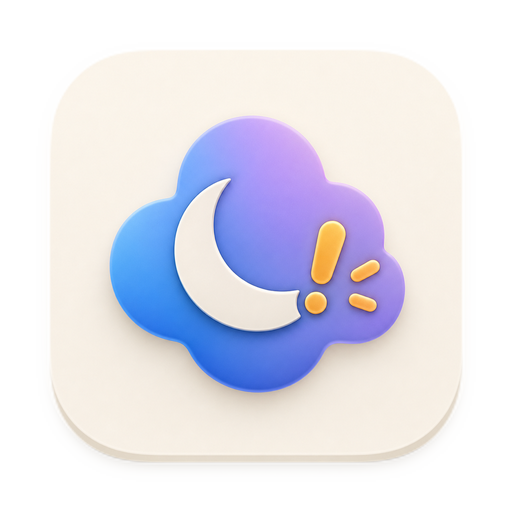
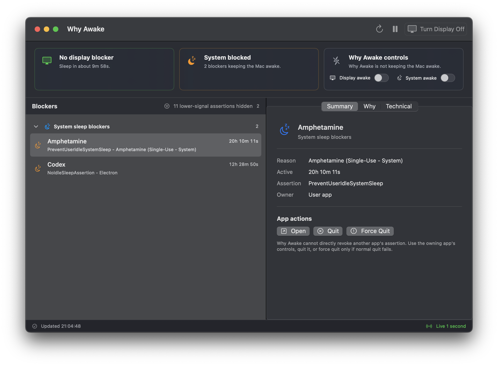
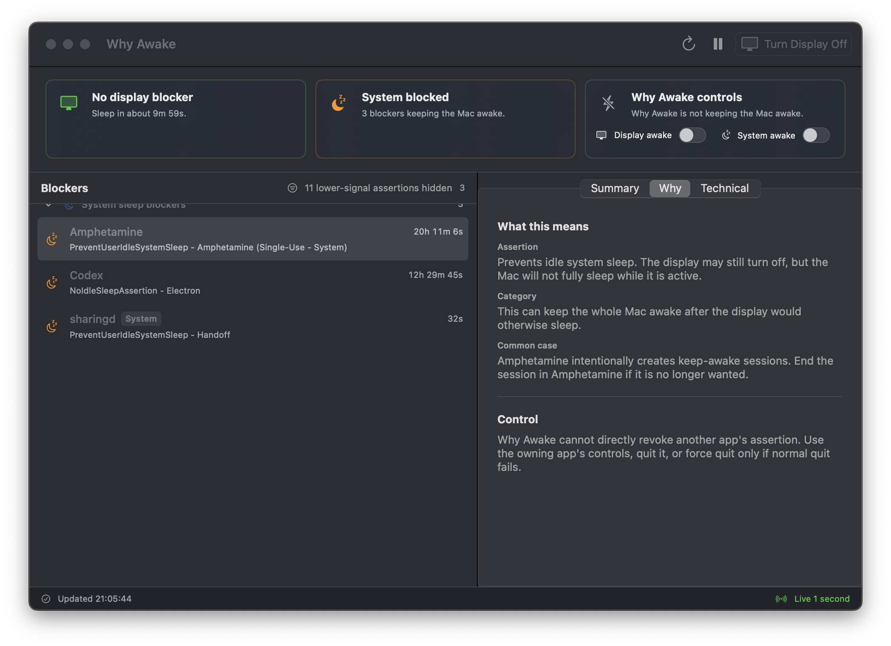

<p align="center">
  
</p>

# Why Awake

Why Awake is a SwiftUI macOS app for answering a specific question: why is the display, or the whole Mac, still awake?

It reads macOS power assertions, groups the useful blockers, and shows the likely owner, assertion type, reason, and duration. It can open or quit an owning user app when that is safe. It does not claim to revoke another app's assertion.



## What It Shows

- Display sleep and system sleep status.
- The app, daemon, or kernel assertion currently blocking sleep.
- Lower-signal assertions, such as user activity or device state, behind a filter.
- Plain-language explanations for common assertion types.
- Safe actions for user apps: open, quit, or explicit force quit.
- Why Awake's own keep-awake toggles, separate from assertions owned by other apps.



## What It Will Not Do

- It will not pretend to revoke another app's assertion directly.
- It will not kill system processes by default.
- It will not hide force quit behind an automatic action.

## Data Sources

- `pmset -g assertions` for active power assertions.
- `pmset -g custom` for display and system sleep timers.
- `pmset -g ps` to choose the active power source timer.
- `ioreg -c IOHIDSystem -r` for HID idle time used in sleep estimates.

## Build And Run

```sh
xcodebuild -list -project "Why Awake.xcodeproj"
./script/build_and_run.sh
```

Useful run modes:

```sh
./script/build_and_run.sh --verify
./script/build_and_run.sh --logs
```

The app target is `Why Awake` and the bundle identifier is `pt.z2.Why-Awake`.

## Tests

Run the unit suite:

```sh
xcodebuild test -project "Why Awake.xcodeproj" -scheme "Why Awake" -destination "platform=macOS" -derivedDataPath /private/tmp/whyawake-dd CODE_SIGNING_ALLOWED=NO -only-testing:"Why AwakeTests"
```

Run one focused test class:

```sh
xcodebuild test -project "Why Awake.xcodeproj" -scheme "Why Awake" -destination "platform=macOS" -derivedDataPath /private/tmp/whyawake-dd CODE_SIGNING_ALLOWED=NO -only-testing:"Why AwakeTests/PowerSettingsParserTests"
```

## Project Map

- `Why Awake/Models`: immutable app data for blockers, snapshots, power settings, history, and keep-awake state.
- `Why Awake/Services`: command execution, `pmset` parsing, app actions, notifications, persistence, and keep-awake control.
- `Why Awake/Stores/WhyAwakeStore.swift`: main app state, refresh loop, history, actions, notifications, and keep-awake coordination.
- `Why Awake/Views`: dashboard, blocker list, detail inspector, menu bar UI, settings, tutorial, and about window.
- `Why Awake/Support/SleepBlockerKnowledge.swift`: assertion explanations, common blocker text, and lower-signal filtering.
- `Why AwakeTests`: parser, policy, and store tests.
